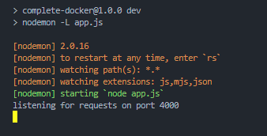

# Dockerrzz 🎭

It's how i basically am learning and infact sharing everything about Docker 🚀

# Lesson 3 : Volumes for containers 🥽

⭐ **VOLUMES** : Volumes are used to mount directories or files from the host into the container so that whenever there are changes in the host, the changes are reflected in the container too.

⭐ Images doesnot changes in volume, changes are just local.

⭐ `docker run --name cont-1 -p 4000:4000 -v D:\Github-files\Dockerrzz\api:/app -v /app/node_modules img-1 `

⭐ **CONTAINER : `cont-1` , IMAGE : `img-1`**

⭐ **LOCAL : `D:\Github-files\Dockerrzz\api` , HOST : `/app`**

# Nodemon FTW 🎢

