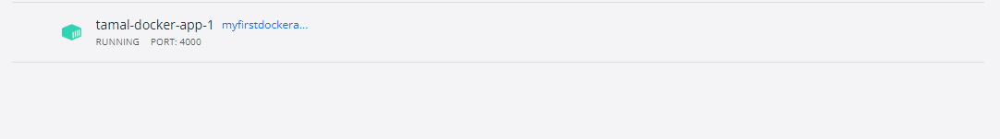

# Dockerrzz 🎭

It's how i basically am learning and infact sharing everything about Docker 🚀

# Lesson 2 : Layer caching, Managing images, containers 🎃

⭐ Here i learnt what a Dockerfile is, and all the basics of an Image, Container

⭐ We are using a NODE Api, to understand how a Dockerfile works.

⭐ Also we are using `Node Ver 17-alpine`

⭐ Also i ran `Docker build -t myfirstdockerapp .` to build a docker image.

⭐ Next up we are gonna see how we can actually use the image inside of a container !!

# Up and running 🎆

