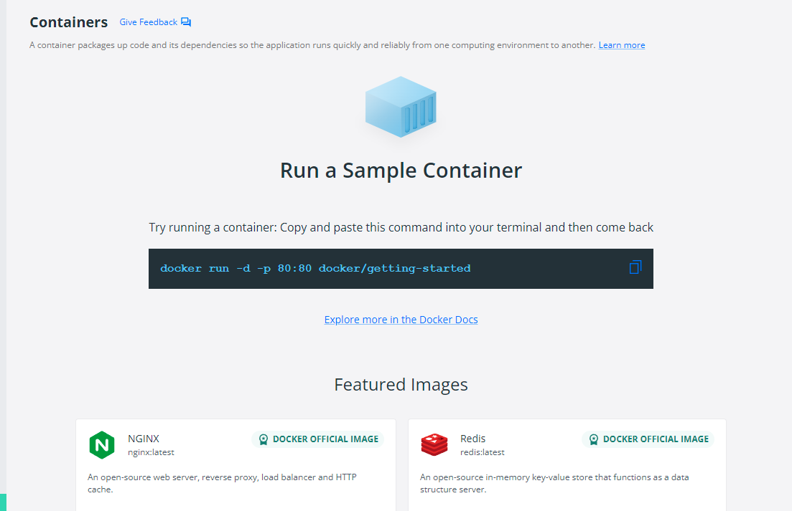

# Dockerrzz 🎭

It's how i basically am learning and infact sharing everything about Docker 🚀

# Lesson 2 : Layer caching, Managing images, containers 🎃

⭐ LAYER CACHING : We have the ability to cache an image layer, so that the next time we build it, we can skip the steps

⭐ So we need to copy the `package.json` file first and then `npm i` it so that we have the node modules already there in cache.

⭐ Then we can `docker build` a new image and the nodemodules and stuffs will be loaded in faster.

⭐ Also there are commands to remove a image, container, everything.

